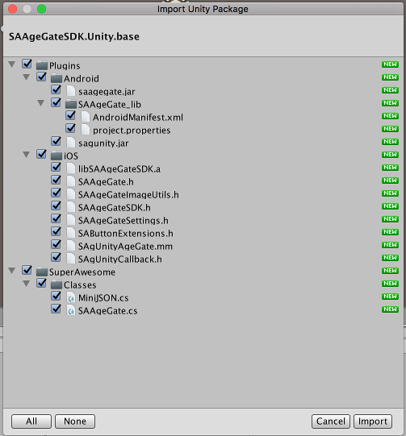
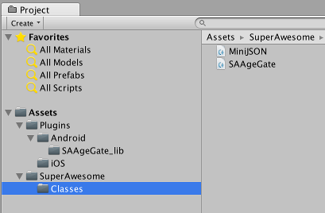

Add the SDK
===========

The Unity Age Gate SDK is built as an Unity Package in order to work together with the Android and iOS native SDKs
so that you can harness the full power of native components for a better overall experience.

To begin integrating the SDK:

First download the latest Unity Age Gate SDK: `SAAgeGateSDK-<sdk_version>.Unity.unitypackage <https://github.com/SuperAwesomeLTD/sa-sdk-build-repo/blob/master/package/ag_unity/<sdk_version>/SAAgeGateSDK-<sdk_version>.Unity.unitypackage?raw=true>`_.

You can then import it into your Unity project as a custom assets package.

You should see an image similar to this:

Select all the files, and click Import.
If all goes well you should have a series of new folders and files in your Assets directory.

Once you've integrated the SDK, you can access it by:

.. code-block:: c#

    using tv.superawesome.sdk.agegate.*;

.. warning:: When exporting for iOS as an XCode project, you'll need to add the following flag to **Other linker flags** in **Build Settings**: -ObjC
