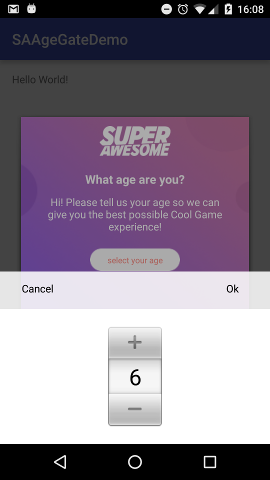

Trigger the Age Gate
====================

In order to easily separate and direct users to different parts of your app based on their age, the Age Gate SDK has two simple methods:
One will add a callback that will notify you of the age the user has selected and one will actually trigger the Age Gate UI.

To set a callback:

.. code-block:: c#

    using tv.superawesome.sdk.agegate.SAAgeGate;

    public class IntroScript : MonoBehaviour {

      void Start () {

        //
        // Set callback for the age gate
        SAAgeGate.setCallback((age: int) => {
          // separate users
        });
      }
    }

To trigger the age gate:

.. code-block:: c#

    using tv.superawesome.sdk.agegate.SAAgeGate;

    public class IntroScript : MonoBehaviour {

      void Start () {

        //
        // ...

        //
        // Start the Age Gate UI
        SAAgeGate.play();
      }
    }

Additionally you can override the display name that's shown on the Age Gate:

.. code-block:: c#

    using tv.superawesome.sdk.agegate.SAAgeGate;

    public class IntroScript : MonoBehaviour {

      void Start () {

        //
        // Override name
        SAAgeGate.overrideName("__MY_APP_NAME__");
      }
    }

Finally, you should see something similar to the following images:

.. warning:: It's recommended to trigger the Age Gate as soon as your app starts, for example, in the first Screen.

.. note:: You can also find out the current stored user's age by asking **SAAgeGate.getCurrentAge();**
